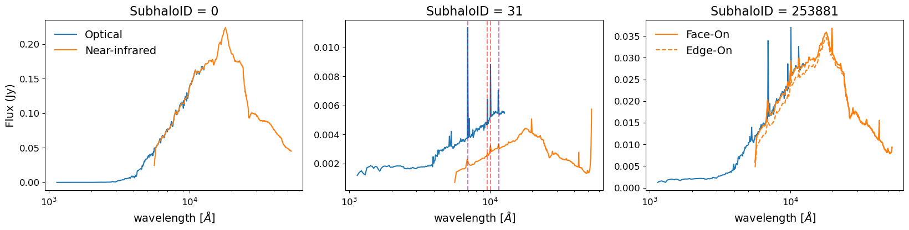
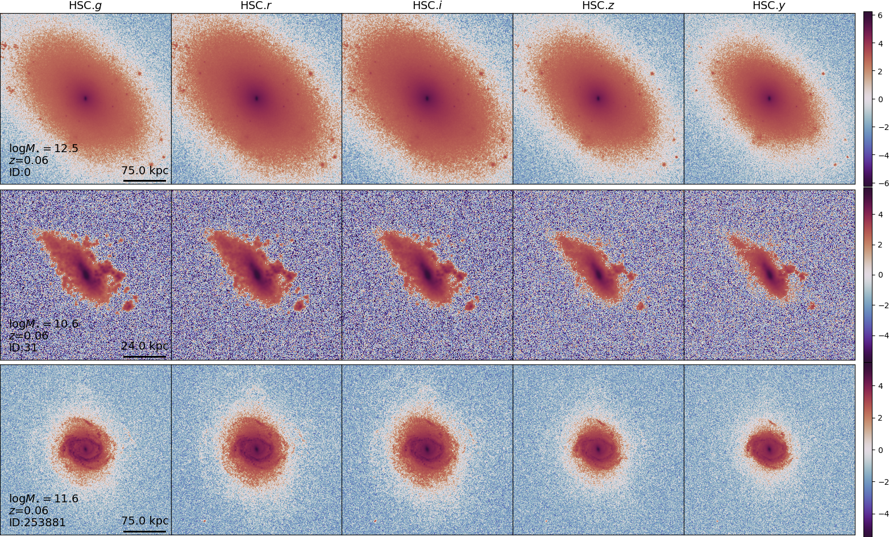
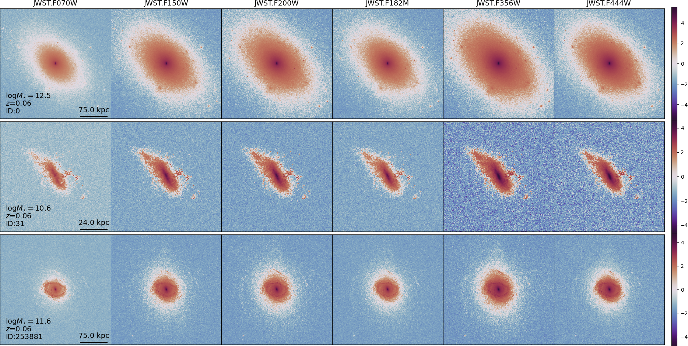

# galaxyGenius

A Mock Galaxy Image Generator for Various Telescopes from Hydrodynamical Simulations

## Results  
### SEDs
  
### HSC
  
### HST WFC3
  
### JWST NIRCam
  
### CSST
  

## Dependence
Python verison:  
`python==3.11.10`  

Python packages:
`tomlkit==0.13.2`  
`numpy==1.24.0` ⚠️  
`scipy==1.13.1`  
`matplotlib==3.9.2`  
`astropy==7.0.0` ⚠️  
`scikit-image==0.24.0`  
`joblib==1.4.2`  
`matplotlib_scalebar==0.8.1`  
`h5py==3.9.0` ⚠️  
`termcolor==2.4.0`  
`photutils==2.0.2`  

⚠️: Package versions should strictly match, otherwise there may be compatibility issues.

Other packages:  
[`illustris_python`](https://github.com/illustristng/illustris_python)  
[`SKIRT9`](https://skirt.ugent.be/root/_installation_guide.html)  

A new Python environment is recommended  

```Python
conda create -n galaxyGenius python=3.11.10  

conda activate galaxyGenius  

pip install .  
```  
`Data` directory should be set in environment, named `GALAXYGENIUS_DATA_DIR` or use
```Bash
export GALAXYGENIUS_DATA_DIR=/path/to/Data
```

## Recommended folder tree
```Bash
├── galaxyGenius/  
│   ├── Data/  
│   ├── galaxyGenius/  
│   ├── Notebooks/  
│   └── (workspace)/  
├── TNG100/  
│   ├── groups_N/  
│   │   ├── fof_subhalo_tab_N.n.hdf5  
│   │   └── ...  
│   └── snapdir_N/  
│       ├── snap_N.n.hdf5  
│       └── ...  
└── postprocessing/  
    └── offsets/  
        ├── offsets_N.hdf5  
        └── ...  
```
We also implement [Web-based API](https://www.tng-project.org/data/docs/api/) in `galaxyGenius`, therefore, users do not even need to download the large snapshots and groups files. This feature can be activated by setting `requests=true` and provide `apiKey` in config. However, the generation speed will be slower and depends on the network speed.  

## Filters and PSFs
Filter throughputs and PSFs of specific surveys are saved in `Data/filters/(survey)` and `Data/PSFs/(survey)` directories.  
The format of filters are recommended to be plain text file with extension `.fil`, including two columns: wavelength (in angstrom) and throughputs.  
PSFs are recommended to be in `numpy.array`, and can be opened by `numpy.loadtxt` or `numpy.load`.  
Please make sure that the filters and PSFs exist in correct directories and formats before running galaxyGenius.

## Sky backgrounds  
Sky background noises are calculated based on the throughput of each filter and sky emission curve.  
We provide a helper notebook for calculation of instrumental noises in [Notebooks/calc_sky_bkg.ipynb](https://github.com/xczhou-astro/galaxyGenius/blob/main/Notebooks/calc_sky_bkg.ipynb).  

## Usage
### Initialization
```Python
python init.py --workspace=workspace --surveys="CSST,HST"
```
`config.ini`, `config_CSST.ini` and `config_HST.ini` will be created in `workspace` directory. Please freely edit them as wish.  

if `surveys` are not specified, `postPostprocessing` will be set as False.

Currently, throughputs and PSFs of filters for CSST, HST, JWST, Roman and HSC are all uploaded. For Euclid, we only upload the filters, since the PSF files cannot be accessed.  

### Run
Enter workspace, and create a python file named `run.py`
```Python
# run.py

from galaxyGenius.config import Configuration
from galaxyGenius.generation import DataGeneration
from galaxyGenius.preprocess import PreProcess
from galaxyGenius.postprocess import PostProcess

config = Configuration() # initialize Configuration class
conf = config.get_config() # read config from current directory

preprocess = PreProcess(conf) # initialize PreProcess class
subhalos = preprocess.get_subhalos() # get subhalos 
subhaloIDs = subhalos['subhaloIDs'] # get subhaloIDs

for i, ID in enumerate(subhaloIDs):

    # Dynamically set parameters
    data = {}
    data['numPackets'] = 1e6

    if i < 100:
        data['inclinations'] = [0]
        data['azimuths'] = [0]
        data['faceAndEdge'] = False
    else:
        data['faceAndEdge'] = True


    preprocess.subhalo(subhaloID=ID) # get properties of subhalo
    preprocess.prepare(data) # prepare for simulation, including retrieving particles and creating .ski file

    dataGeneration = DataGeneration(config=conf) # initialize DataGeneration class
    dataGeneration.runSKIRT() # run SKIRT

    postprocess = PostProcess(subhaloID=ID, config=conf) # initialize PostProcess class
    postprocess.runPostprocess() # run postprocessing
```  
then `python run.py`. 

Or you can interactively run in jupyter as illustrated in [Notebooks/tutorial.ipynb](https://github.com/xczhou-astro/galaxyGenius/blob/main/Notebooks/tutorial.ipynb).  

### For hydrodynamical simulations except TNG
Necessary particle data and properties need to be created and saved in `workingDir (run)` in advance, and call `preprocess.inputs(data)` and subsequent methods to perform the galaxy generation. An example for EAGLE simulation is provided in [EAGLE/eagle.ipynb](https://github.com/xczhou-astro/galaxyGenius/blob/main/EAGLE/eagle.ipynb).  
data: `dict`  
`snapRedshift`, `cosmology`, `stellarMass`, `subhaloID`, `boxLength` keys are required.


### Outputs
`./dataCubes` includes the IFU-like raw dataCubes and SEDs of **SubhaloID** generated by SKIRT and auxiliary files.  
`./mock_CSST` includes the bandpass images and SEDs of **SubhaloID** for CSST.  
`./mock_HST` includes the bandpass images and SEDs of **SubhaloID** for HST.  

Folder tree:
```bash
dataCubes/
└── Subhalo_(ID)/
    ├── config.json # recorded config for dynamical modification
    ├── dusts.txt # dust particles from gas particles
    ├── properties.json # properties of the subhalo and surveys
    ├── skirt_log.txt # log file of SKIRT
    ├── skirt_parameters.xml # SKIRT execution file 
    ├── skirt_view_(ViewID)_sed.dat # Generated SEDs
    ├── skirt_view_(ViewID)_total.fits # Generated dataCubes
    ├── starforming_regions.txt # starforming regions
    └── stars.txt # star particles
```

```bash
mock_(survey)/
└── Subhalo_(ID)/
    ├── galaxy_images.fits # bandpass images 
    ├── galaxy_SED_(ViewID).png # Plot of SEDs
    ├── galaxy_SEDs.fits # SEDs
    └── galaxy_view_(ViewID).png # Plot of bandpass images
```

Bandpass images are saved in pages of fits file, and each page includes images in different views.

## Documentaion
For classes and configuration sets, please refer to documentation