# galaxyGenius

Mock Galaxy Image Generator for Various Telescopes from Hydrodynamical Simulations  

This work is published on A&A at https://doi.org/10.1051/0004-6361/202554287

## Results  
### Workflow
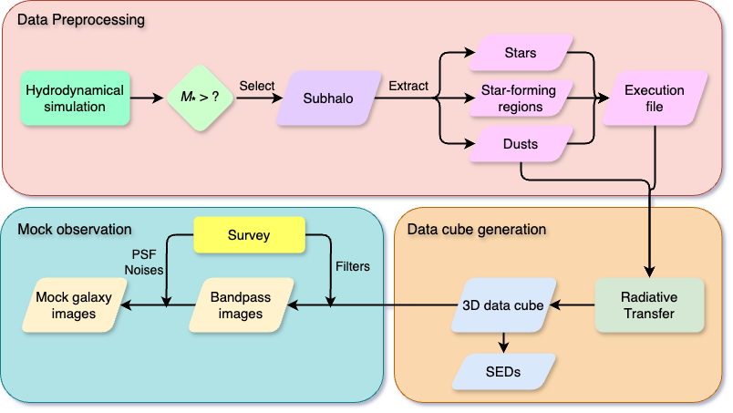
### SEDs
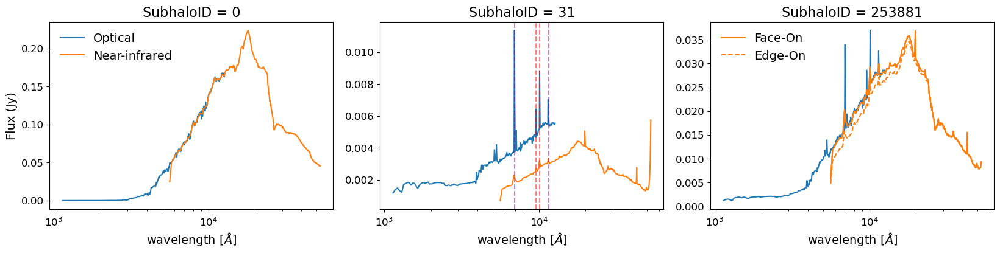  
### CSST
  
### Euclid
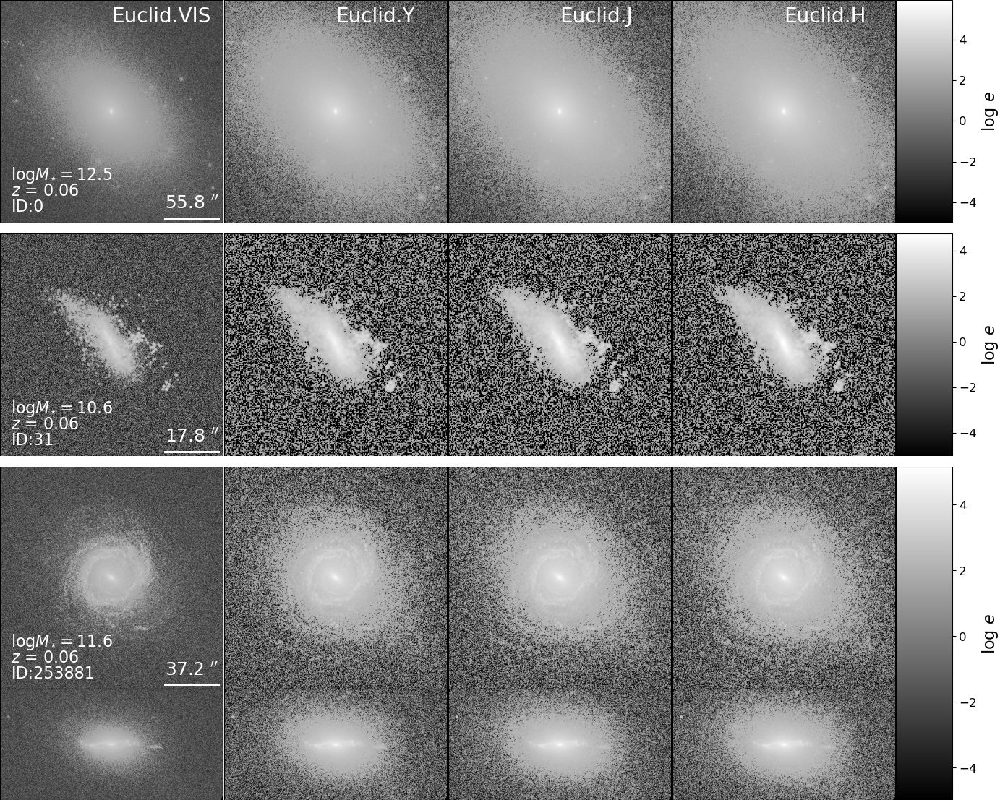  
### JWST NIRCam
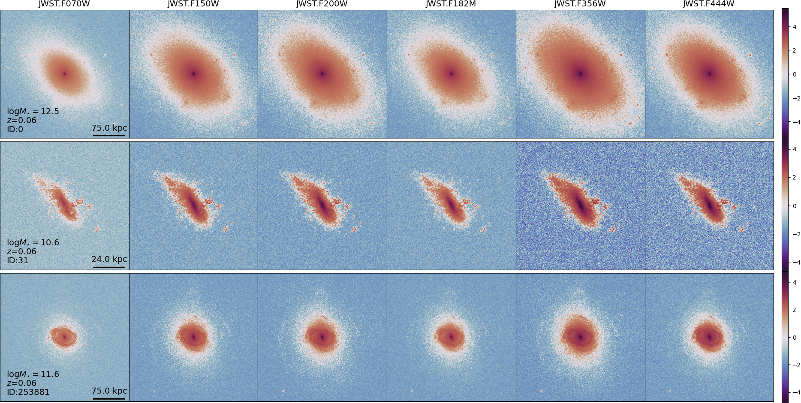  
### HSC
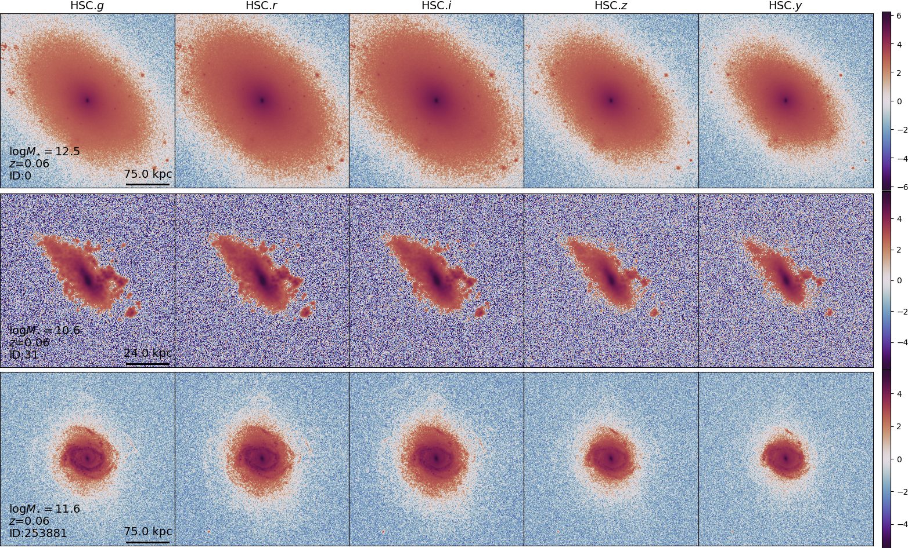  
### RGB  
Created using default parameters for `make_rgb` in Astropy  
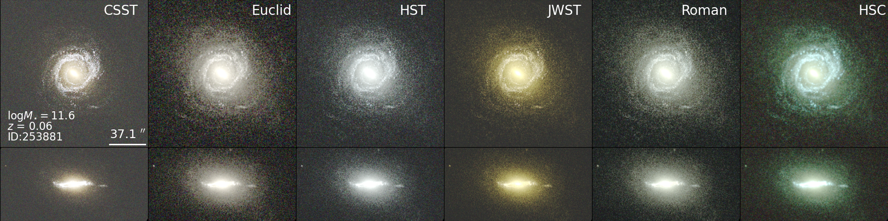  

## Dependence
Python verison:  
`python>=3.11`  

Python packages:  
`tomlkit`  
`numpy`  
`scipy`  
`matplotlib`  
`astropy`  
`scikit-image`  
`joblib`  
`matplotlib_scalebar`  
`h5py`  
`termcolor`  
`photutils`  
`requests`  
[`illustris_python`](https://github.com/illustristng/illustris_python)  
`numba`  

Other packages:  
[`SKIRT9`](https://skirt.ugent.be/root/_installation_guide.html)  

A new Python environment is recommended  

```Python
conda create -n galaxyGenius python=3.11  

conda activate galaxyGenius  

pip install .  
```  
`Data` directory should be set in environment, named `GALAXYGENIUS_DATA_DIR` or use
```Bash
export GALAXYGENIUS_DATA_DIR=/path/to/Data
```
or add `os.environ['GALAXYGENIUS_DATA_DIR'] = '/path/to/Data'` in your python script.

## Recommended folder tree
```Bash
├── galaxyGenius/  
│   ├── Data/  
│   ├── galaxyGenius/  
│   ├── Notebooks/  
│   └── (workspace)/  
├── TNG100/  
│   ├── groups_N/  
│   │   ├── fof_subhalo_tab_N.n.hdf5  
│   │   └── ...  
│   └── snapdir_N/  
│       ├── snap_N.n.hdf5  
│       └── ...  
└── postprocessing/  
    └── offsets/  
        ├── offsets_N.hdf5  
        └── ...  
```
We also implement [Web-based API](https://www.tng-project.org/data/docs/api/) in `galaxyGenius`, therefore, users do not need to download the large snapshots and groups files. This feature can be activated by setting `requests=true` and provide users' `apiKey` in config. However, the generation speed will be slower and depends on the network speed.  

## Filters and PSFs
Filter throughputs and PSFs of specific surveys are saved in `Data/filters/(survey)` and `Data/PSFs/(survey)` directories.  
The format of filters are recommended to be plain text file with extension `.fil`, including two columns: wavelength (in angstrom) and throughputs.  
PSFs are recommended to be in `numpy.array`, and can be opened by `numpy.loadtxt` or `numpy.load`.  
Please make sure that the filters and PSFs exist in correct directories and formats before running galaxyGenius.

## Sky backgrounds  
Sky background noises are calculated based on the throughput of each filter and sky emission curve.  
We provide a helper notebook for calculation of instrumental noises in [Notebooks/calc_sky_bkg.ipynb](https://github.com/xczhou-astro/galaxyGenius/blob/main/Bkg/calc_sky_bkg.ipynb).  

## Usage
### Initialization
```Python
python init.py --workspace=workspace --surveys="CSST,HSC"
```
`config.toml`, `config_CSST.toml` and `config_HSC.toml` will be created in `workspace` directory. Please freely edit them as wish.  

if `surveys` are not specified, `postPostprocessing` will be set as False.

Currently, throughputs and PSFs of filters for CSST, HST, JWST, Roman and HSC are all uploaded. For Euclid, we only upload the filters, since the PSF files cannot be accessed.  

### Run
Enter workspace, and create a python file named `run.py`
```Python
# run.py

from galaxyGenius.config import Configuration
from galaxyGenius.generation import DataGeneration
from galaxyGenius.preprocess import PreProcess
from galaxyGenius.postprocess import PostProcess

config = Configuration() # initialize Configuration class
conf = config.get_config() # read config from current directory

preprocess = PreProcess(conf) # initialize PreProcess class
subhalos = preprocess.get_subhalos() # get subhalos 
subhaloIDs = subhalos['subhaloIDs'] # get subhaloIDs

for i, ID in enumerate(subhaloIDs):

    # Dynamically set parameters
    arguments = {}
    arguments['numPackets'] = 1e6

    if i < 100:
        arguments['numViews'] = 1
        arguments['inclinations'] = [0]
        arguments['azimuths'] = [0]
        arguments['faceAndEdge'] = False
    else:
        arguments['faceAndEdge'] = True


    preprocess.subhalo(subhaloID=ID) # get properties of subhalo
    preprocess.prepare(arguments) # prepare for simulation, including retrieving particles and creating .ski file

    dataGeneration = DataGeneration(config=conf) # initialize DataGeneration class
    dataGeneration.runSKIRT(skirtPATh='path/to/skirt') # run SKIRT, skirtPATH=None if skirt is in environment

    postprocess = PostProcess(subhaloID=ID) # initialize PostProcess class
    postprocess.runPostprocess() # run postprocessing
```  
then `python run.py`. 

Or you can interactively run in jupyter as illustrated in [Notebooks/tutorial.ipynb](https://github.com/xczhou-astro/galaxyGenius/blob/main/Notebooks/tutorial.ipynb).  

### Particle Input Methods

The `PreProcess` stage supports five distinct methods for obtaining subhalo and particle data:

1. **From Local TNG Snapshots**: The default behavior when `requests = False` in the configuration. The pipeline uses `illustris_python` to automatically extract subhalos and particles from a local TNG snapshot directory.
2. **From TNG Web API**: Activated by setting `requests = True` in the configuration. The pipeline will query the TNG project's API to download subhalo cutouts dynamically. This is slower but requires no local snapshot data.
3. **From a Local Subhalo File (For TNG)**: If you have downloaded an individual cutout and metadata for a TNG subhalo in advance, you can load the local HDF5 file directly using `preprocess.inputSubhaloParticleFile(filepath, subhaloInfo)`. See `Examples/2-input_subhalo_file.py`.

For other simulations (e.g., EAGLE), two additional methods are available:

4. **From Particles in Memory (`preprocess.inputParticles`)**: Load extracted particles into memory as dictionaries of `astropy.units.Quantity` objects. Then, customize `starFunction`, `starFormingFunction`, and `dustFunction` to process them into `stars.txt`, `dusts.txt`, and `starforming_regions.txt` files using `preprocess.createFile()`. An example implementation is provided in [EAGLE/eagle.ipynb](https://github.com/xczhou-astro/galaxyGenius/blob/main/EAGLE/eagle.ipynb).
5. **From Particle Files Created in Advance (`preprocess.inputs`)**: If you have already generated the `stars.txt`, `dusts.txt`, and `starforming_regions.txt` files independently, use `preprocess.inputs(data)` to point the pipeline to them. The `data` argument is a `dict` requiring three metadata keys: `['SubhaloID', 'stellarMass', 'halfStellarMassRadius']`.

## Example for EAGLE

### SED
<p float="left">
  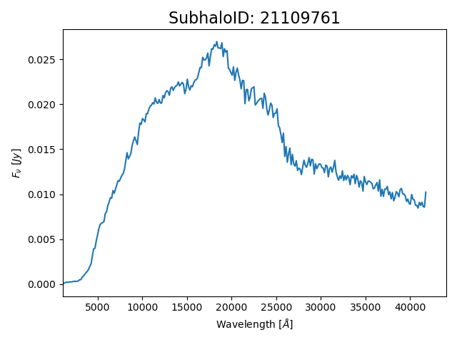
  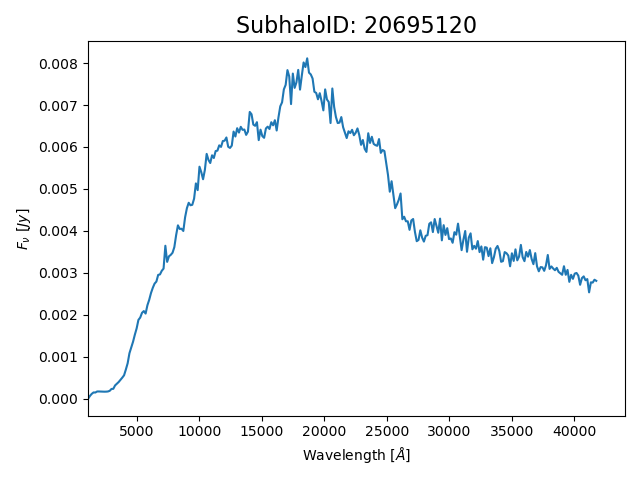 
</p>

### CSST
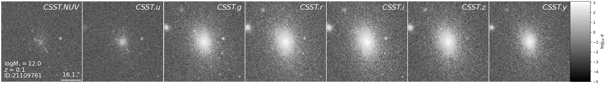
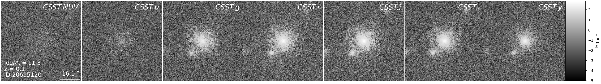

### Euclid
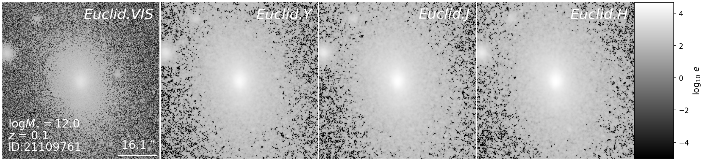
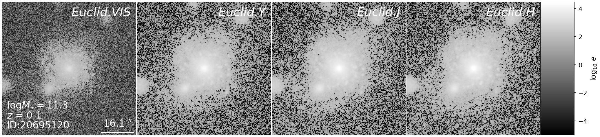

### JWST
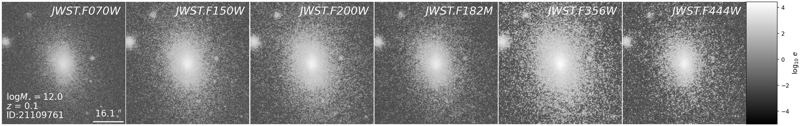
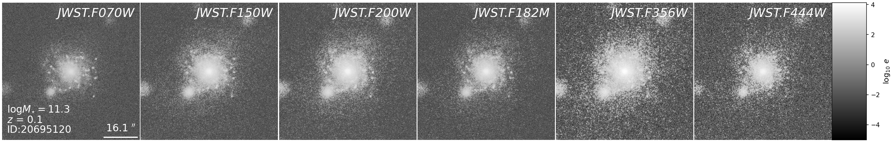


### Outputs
`./dataCubes` includes the IFU-like raw dataCubes and SEDs of **SubhaloID** generated by SKIRT and auxiliary files.  
`./mock_CSST` includes the bandpass images and SEDs of **SubhaloID** for CSST.  
`./mock_HST` includes the bandpass images and SEDs of **SubhaloID** for HST.  

Folder tree:
```bash
dataCubes/
└── Subhalo_(ID)/
    ├── config.json # recorded config for dynamical modification
    ├── dusts.txt # dust particles from gas particles
    ├── properties.json # properties of the subhalo and surveys
    ├── skirt_log.txt # log file of SKIRT
    ├── skirt_parameters.xml # SKIRT execution file 
    ├── skirt_view_(ViewID)_sed.dat # Generated SEDs
    ├── skirt_view_(ViewID)_total.fits # Generated dataCubes
    ├── starforming_regions.txt # starforming regions
    └── stars.txt # star particles
```

```bash
mock_(survey)/
└── Subhalo_(ID)/
    ├── galaxy_images.fits # bandpass images 
    ├── galaxy_SED_(ViewID).png # Plot of SEDs
    ├── galaxy_SEDs.fits # SEDs
    └── galaxy_view_(ViewID).png # Plot of bandpass images
```

Galaxy images in each band are saved in each extension of the fits file, and each extension includes images in different views.  

## Documentaion
For classes and configuration sets, please refer to [documentation](https://xczhou-astro.github.io/galaxyGenius/).

## Citation
Please cite the paper by:  
```bash
@ARTICLE{2025A&A...700A.120Z,
       author = {{Zhou}, Xingchen and {Yang}, Hang and {Li}, Nan and {Xiong}, Qi and {Deng}, Furen and {Meng}, Xian-Min and {Ye}, Renhao and {Shen}, Shiyin and {Wei}, Peng and {Cui}, Qifan and {He}, Zizhao and {Ibitoye}, Ayodeji and {Wei}, Chengliang and {Fang}, Yuedong},
        title = "{GalaxyGenius: Mock galaxy image generator for various telescopes from hydrodynamical simulations}",
      journal = {\aap},
     keywords = {radiative transfer, methods: data analysis, galaxies: formation, Instrumentation and Methods for Astrophysics, Cosmology and Nongalactic Astrophysics, Astrophysics of Galaxies},
         year = 2025,
        month = aug,
       volume = {700},
          eid = {A120},
        pages = {A120},
          doi = {10.1051/0004-6361/202554287},
archivePrefix = {arXiv},
       eprint = {2506.15060},
 primaryClass = {astro-ph.IM},
       adsurl = {https://ui.adsabs.harvard.edu/abs/2025A&A...700A.120Z},
      adsnote = {Provided by the SAO/NASA Astrophysics Data System}
}
```

## Updates  
- 2026-01-03  
1. Fix loggging functionality.  
2. Add Toddlers SED family ([Kapoor et al. 2023](https://academic.oup.com/mnras/article/526/3/3871/7287615), [2024](https://www.aanda.org/10.1051/0004-6361/202451207)) to process star forming regions.  
3. Modify default smoothing length to employ 32+-1 nearest stellar particles (`StellarHsml`) for star and star-forming regions ([Baes et al. 2024](https://www.aanda.org/10.1051/0004-6361/202348418)). Note that the values can be changed by defining your own `starFunction` and `starformingFunction`, see `EAGLE/eagle.ipynb` for details.  

- 2025-10-27 (Big Update)  
1. Add support to input subhalo data file in h5 format (Please refer to `Examples/2-input_subhalo_file.py`).  
2. Add support to input extracted particles from subhalo (Please refer to `EAGLE/eagle.ipynb`).  
3. Add a singleton for unit conventions for various simulations (Please refer to `Examples/2-input_subhalo_file.py` for usage).  
4. Add logging for galaxyGenius routine.  

- 2025-07-01  
1. Add support for simulation mode of ExtinctionOnly (thanks comments from Maarten Baes, Qi Zeng, Andrea Gebek, Nick Andreads and members of SKIRT team.)  
    ExtinctionOnly is used when extinction and scattering of dust should be considered,  
    DustEmission is used when extinction and scattering along with secondary emission caused by dust should be considered,  
    NoMedium is an ideal case with no dust elements.  

- 2025-06-03  
1. Add support for deriving noise level from limiting magnitudes.  
2. Add support for estimating if galaxy is a spiral or not (Please use with caution).  

- 2025-05-30  
1. Add return code for `runSKIRT` in `generation.py`.  

- 2025-04-28  
1. Add support for viewRedshift.  
2. Bug several fixes.  

- 2025-04-22:   
1. Add support for local cosmology, and view distance for instrument.  
2. Add check for hydrodynamic solver: VoronoiMesh (TNG) and smoothParticle (EAGLE).  
3. Replace ExtinctionOnly simulation mode to NoMedium.  
4. Add support for field of view instead of setting it equal boxlength.  
5. Add support for only output SEDs.  

- 2025-02-20:  
1. Add check and retry features for requests to handle failure of Web-based API.  

- 2026-05-15:
1. Add visualization for all band images.
2. Fix several bugs.